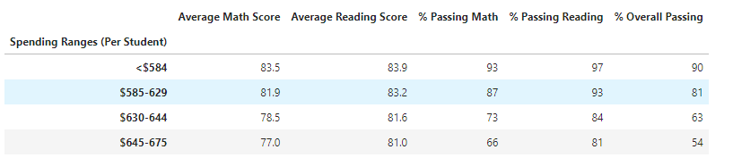
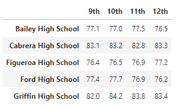
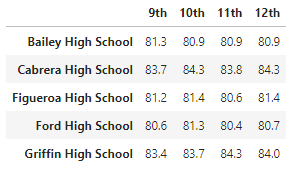
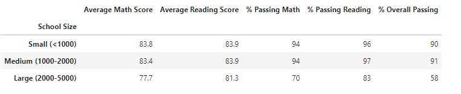
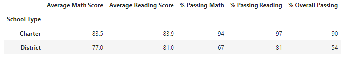

# School-District-Analysis

## Overview of the school district analysis:

The purpose of this project is to analyze student math and reading scores in relation to school attributes and metrics to uncover academic trends.

The school data set was provided with no missing values or other issues. The student data set had some errors that we fixed before proceeding with the analysis. We cleaned up student names as some of the student names included titles. We also removed math and reading scores for 9th graders at Thomas High School due to concerns with academic dishonesty. 

## Results:

### Scores by School Spending

There is a negative correlation between the spending per student and passing rates for both math and reading. The higher the spending the lower are the passing rates (math, reading and overall): 

This seems counterintuitive and I would want to dive deeper into the data to see what else could be driving the difference in passing rates.

### Highest and Lowest Performing Schools

Based on the percentage of students who passed both math and reading (>=70), the following schools were highest and lowest performing schools in the district:

|Highest Performing Schools| Lowest Performing Schools|
|--------|-------|
Cabrera High School | Rodriguez High School
Griffin High School	Charter | Figueroa High School
Wilson High School | Huang High School

### Math and Reading Scores by Grade

There does not seem to be a correlation between the grade and the math/reading scores of the students. The scores are fairly consistent across multiple grades for the same school:

| Math Scores | Reading Scores|
|-------------|---------------|
| | |

### Scores by School Size

Both math and reading padding percentages stay relatively close for small and middle sized schools (>90) but drop significantly for large size schools (58% overall passing percent of students):

### Scores by School Type

Percentages of students who passed both math and reading are significantly higher for charter schools than for district schools. The higher passing rates are being driven mostly by math passing rates:

## Summary:

After replacing the scores for math and reading for 9th grade at Thomas High School, the overall passing rates for various cuts (schools by type, size, spending) have not changed significantly.
